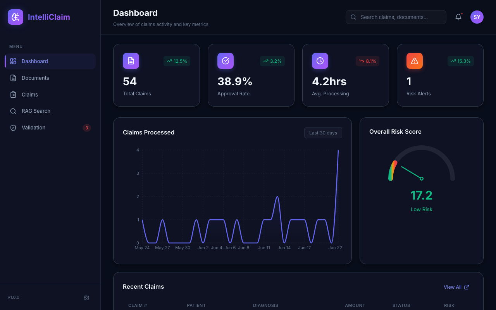
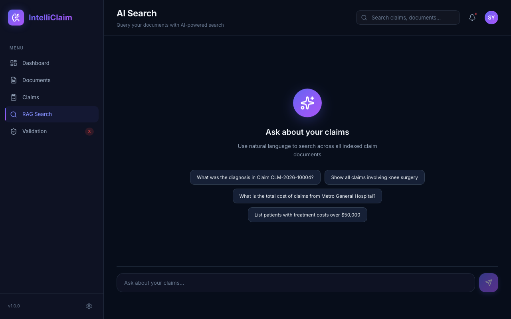
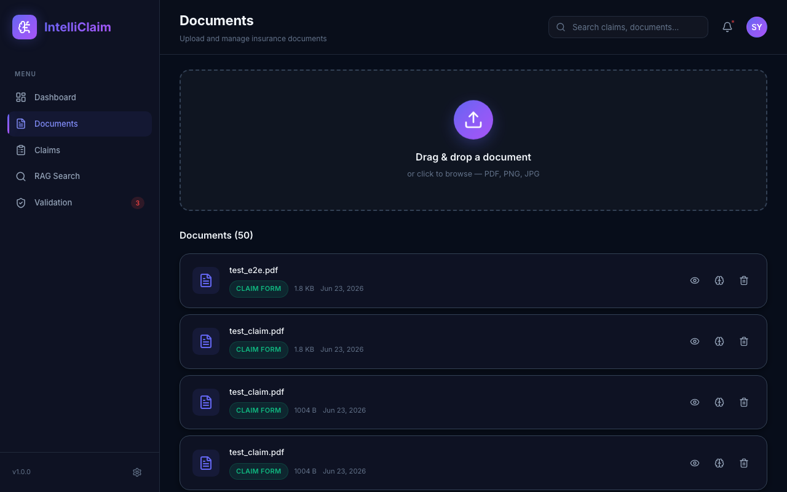
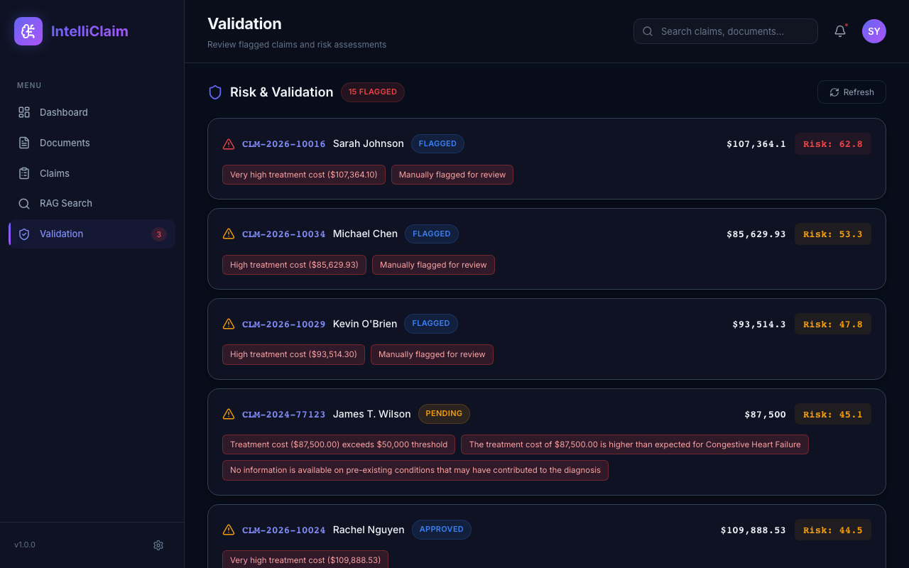
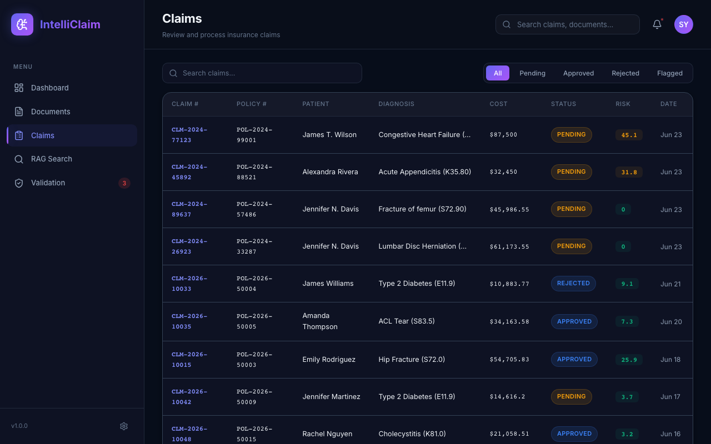
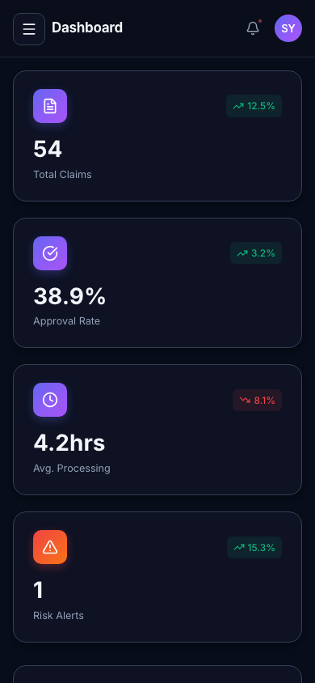

# IntelliClaim AI

**Insurance Document Intelligence Platform** — AI-powered claim processing, OCR extraction, RAG search, and fraud risk detection.


---

## Live Demo

| | URL |
|---|---|
| **Frontend** | https://intelliclaim-ai.vercel.app |
| **API Docs** | https://intelliclaim-ai-production.up.railway.app/docs |
| **Health** | https://intelliclaim-ai-production.up.railway.app/api/health |

---

## Screenshots

| Dashboard | AI Search |
|:---------:|:---------:|
|  |  |

| Documents | Validation |
|:---------:|:----------:|
|  |  |

| Claims | Mobile |
|:------:|:------:|
|  |  |

---

## Overview

IntelliClaim AI automates the full lifecycle of insurance claim processing — from raw PDF/image ingestion through OCR, AI-powered structured data extraction, semantic document search, and AI-assisted fraud risk scoring — all running on a completely free stack.

### What I Built

- **End-to-end AI document pipeline** using React, FastAPI, Groq (Llama 3.3 70B), MongoDB Atlas, and Docker. Processes PDFs and images with Tesseract OCR, classifies document types, and extracts 11 structured claim fields with confidence scoring.

- **Retrieval-Augmented Generation (RAG) system** using LangChain, LlamaIndex, ChromaDB, and fastembed (ONNX embeddings). Enables semantic search and natural-language querying across insurance claim documents and historical records.

- **AI-assisted validation and fraud detection** using Groq Llama with hybrid scoring: rule-based checks (missing fields, duplicate detection, billing thresholds, date logic) combined with AI risk scoring that produces structured flags, severity levels, and plain-English summaries.

- **Scalable async backend** using FastAPI with Motor (async MongoDB), modular service-oriented design, MongoDB aggregation analytics, and containerised deployment on Railway.

---

## Features

- **Document Processing** — Upload PDFs/images, OCR via PyMuPDF + Tesseract, keyword-based document classification
- **AI Data Extraction** — Groq Llama 3.3 70B extracts 11 structured claim fields (policy number, patient name, diagnosis, treatment cost, dates, hospital, provider ID) with JSON response formatting
- **RAG Search** — fastembed ONNX embeddings index documents into ChromaDB; LangChain LCEL chain handles natural-language Q&A over indexed claims
- **AI Fraud Detection** — Hybrid rule-based + Groq AI risk scoring; produces risk score (0–100), risk level (low/medium/high), structured flags with severity, and AI summary
- **Claims Management** — Full CRUD, status tracking (pending/approved/rejected), duplicate detection
- **Analytics Dashboard** — MongoDB aggregation pipelines for 30-day claims trend, risk distribution, recent activity
- **Mobile-Responsive UI** — Collapsible sidebar, stacked cards, horizontal-scroll tables

---

## Architecture

```
┌─────────────────────────────────────────────────────────┐
│                   Browser / Mobile                       │
│          React 19 + Vite  (Vercel CDN)                  │
└────────────────────┬────────────────────────────────────┘
                     │ HTTPS / REST
┌────────────────────▼────────────────────────────────────┐
│              FastAPI Backend  (Railway)                  │
│                                                          │
│  ┌──────────┐  ┌───────────┐  ┌────────┐  ┌─────────┐  │
│  │   OCR    │  │Extraction │  │  RAG   │  │Validate │  │
│  │PyMuPDF + │  │Groq Llama │  │fastemb.│  │Rule +   │  │
│  │Tesseract │  │3.3 70B    │  │+Chroma │  │Groq AI  │  │
│  └──────────┘  └───────────┘  └────────┘  └─────────┘  │
│                                                          │
│  ┌──────────────────────────┐  ┌──────────────────────┐ │
│  │   MongoDB Atlas (Motor)  │  │  ChromaDB (persisted) │ │
│  │   Claims, Documents      │  │  Vector embeddings    │ │
│  └──────────────────────────┘  └──────────────────────┘ │
└─────────────────────────────────────────────────────────┘
                     │
          ┌──────────▼──────────┐
          │   Groq API (free)   │
          │  llama-3.3-70b-     │
          │  versatile          │
          └─────────────────────┘
```

---

## Tech Stack

| Layer | Technology |
|---|---|
| **Frontend** | React 19.2.7, Vite 8, React Router 7, Recharts, Lucide Icons, Axios |
| **Backend** | Python 3.13, FastAPI 0.137.2, Pydantic v2, Motor 3.7.1 |
| **AI (primary)** | Groq SDK — `llama-3.3-70b-versatile` (free, no billing) |
| **AI (fallback)** | LangChain 1.3.10, LlamaIndex 0.14.22 (OpenAI path, optional) |
| **Embeddings** | fastembed 0.3.6 — BAAI/bge-small-en-v1.5 via ONNX (~23 MB) |
| **Vector DB** | ChromaDB 1.5.9 (persistent) |
| **Database** | MongoDB Atlas M0 (free tier) via Motor |
| **OCR** | PyMuPDF 1.27 + pytesseract 0.3.13 |
| **Deployment** | Vercel (frontend) + Railway Docker (backend) |

---

## Quick Start

### Prerequisites
- Node.js ≥ 20
- Python ≥ 3.11
- MongoDB (local or Atlas)
- Groq API key — free at [console.groq.com](https://console.groq.com) (no credit card)

### 1. Clone

```bash
git clone https://github.com/shreyashyadav1/intelliclaim-ai.git
cd intelliclaim-ai
```

### 2. Backend

```bash
cd backend
python3 -m venv venv
source venv/bin/activate        # Windows: venv\Scripts\activate
pip install -r requirements.txt

# Install Tesseract OCR (macOS)
brew install tesseract
# Ubuntu: sudo apt-get install tesseract-ocr

# Create .env
cp .env.example .env            # then fill in values (see below)

# Seed demo data
python seed_data.py

# Start API
uvicorn main:app --reload --port 8000
```

### 3. Frontend

```bash
cd frontend
npm install
npm run dev
```

Open **http://localhost:5173**

---

## Environment Variables

### Backend (`backend/.env`)

```env
# Required
MONGODB_URI=mongodb+srv://<user>:<pass>@cluster0.xxxxx.mongodb.net/intelliclaim
GROQ_API_KEY=gsk_...         # free at console.groq.com

# Optional — enables OpenAI fallback path
OPENAI_API_KEY=sk-...

# Storage (defaults to local filesystem)
STORAGE_TYPE=local
LOCAL_STORAGE_PATH=./uploads

# CORS — add your Vercel URL when deploying
ALLOWED_ORIGINS=["http://localhost:5173","https://your-app.vercel.app"]
```

### Frontend (`frontend/.env`)

```env
VITE_API_URL=http://localhost:8000   # or Railway URL in production
```

---

## Deployment

### Backend → Railway

1. Push this repo to GitHub
2. Create new Railway project → Deploy from GitHub repo
3. Railway detects the root `Dockerfile` automatically
4. Set environment variables in Railway dashboard:
   - `MONGODB_URI`
   - `GROQ_API_KEY`
5. Railway assigns a public URL — copy it

### Frontend → Vercel

1. Import the GitHub repo in Vercel
2. Vercel uses `vercel.json` at the root (builds from `frontend/`)
3. Set environment variable:
   - `VITE_API_URL` = your Railway backend URL
4. Deploy

---

## API Reference

| Method | Endpoint | Description |
|---|---|---|
| `GET` | `/api/health` | Health check — AI provider, config status |
| `POST` | `/api/documents/upload` | Upload PDF/image — OCR + classification |
| `GET` | `/api/documents` | List all documents |
| `POST` | `/api/extract/{doc_id}` | AI field extraction (Groq Llama) |
| `GET` | `/api/claims` | List claims (filter by status, risk) |
| `GET` | `/api/claims/{id}` | Claim detail |
| `PUT` | `/api/claims/{id}` | Update claim status |
| `DELETE` | `/api/claims/{id}` | Delete claim |
| `POST` | `/api/rag/index/{doc_id}` | Index document for semantic search |
| `POST` | `/api/rag/query` | Natural-language RAG query |
| `GET` | `/api/rag/stats` | Vector index stats |
| `POST` | `/api/validate/{claim_id}` | AI fraud risk validation |
| `GET` | `/api/analytics/recent-claims` | Recent claims feed |
| `GET` | `/api/analytics/claims-trend` | 30-day trend data |

Full interactive docs: **https://intelliclaim-ai-production.up.railway.app/docs**

---

## Project Structure

```
intelliclaim-ai/
├── Dockerfile                    # Root Dockerfile for Railway
├── railway.toml                  # Railway build config
├── vercel.json                   # Vercel monorepo build config
├── backend/
│   ├── main.py                   # FastAPI app — lifespan, CORS, routers
│   ├── config.py                 # Pydantic v2 settings
│   ├── requirements.txt
│   ├── seed_data.py              # Demo data seeder
│   ├── db/
│   │   └── connection.py         # Motor async MongoDB
│   ├── models/                   # Pydantic request/response models
│   ├── routers/                  # API route handlers
│   │   ├── documents.py
│   │   ├── claims.py
│   │   ├── extraction.py
│   │   ├── rag.py
│   │   ├── validation.py
│   │   └── analytics.py
│   ├── services/                 # Business logic
│   │   ├── ocr_service.py        # PyMuPDF + Tesseract OCR
│   │   ├── extraction_service.py # Groq structured extraction
│   │   ├── rag_service.py        # fastembed + ChromaDB + LangChain/LlamaIndex
│   │   ├── validation_service.py # Rule-based + Groq AI validation
│   │   ├── analytics_service.py  # MongoDB aggregation pipelines
│   │   └── storage_service.py    # File storage (local / S3)
│   └── tests/                    # pytest suite (24 tests)
└── frontend/
    ├── src/
    │   ├── components/           # Layout, Sidebar, shared UI
    │   ├── pages/                # Dashboard, Documents, Claims, RAGSearch, Validation
    │   ├── services/             # Axios API client
    │   └── hooks/                # Custom React hooks
    └── index.html
```

---

## Implementation Highlights

### Groq AI Extraction
`services/extraction_service.py` — `_extract_with_groq()`

Uses `llama-3.3-70b-versatile` with `response_format: json_object` to extract 11 structured fields from raw OCR text. Confidence score is computed as `filled_fields / 11`.

### RAG Pipeline
`services/rag_service.py`

- **Indexing**: fastembed `TextEmbedding` (BAAI/bge-small-en-v1.5, ONNX) generates vectors → ChromaDB `upsert` with overlapping 500-char chunks
- **Querying**: same fastembed model embeds the question → ChromaDB cosine similarity search → Groq Llama generates grounded answer from retrieved context
- **OpenAI path** (if `OPENAI_API_KEY` set): LlamaIndex `VectorStoreIndex` + LangChain LCEL chain with `text-embedding-3-small`

### Hybrid Fraud Scoring
`services/validation_service.py`

```
composite_score = rule_score + (ai_score × 0.4 × ai_confidence)
```

Rule checks: missing fields, duplicate detection (MongoDB), billing thresholds ($50k / $150k), date logic, suspicious diagnosis keywords. Groq AI adds structured flags with type, severity, and confidence.

---

## Skills Demonstrated

- Groq SDK + LLM-powered structured JSON extraction
- LangChain LCEL retrieval chains (Chroma + embeddings + LLM)
- LlamaIndex vector indexing (VectorStoreIndex + ChromaVectorStore)
- fastembed ONNX embeddings (no GPU, no PyTorch)
- FastAPI async architecture with Motor (async MongoDB)
- React 19 with Recharts, React Router 7, Lucide Icons
- MongoDB aggregation pipelines for analytics
- Docker containerisation + Railway deployment
- Vercel monorepo deployment with custom build config
- Mobile-responsive UI design

---

## License

MIT
